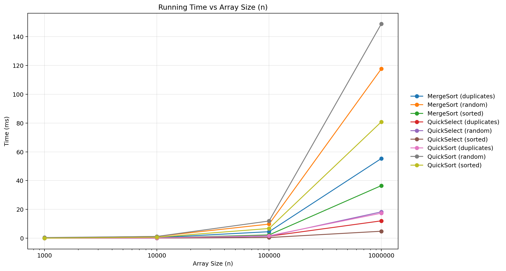
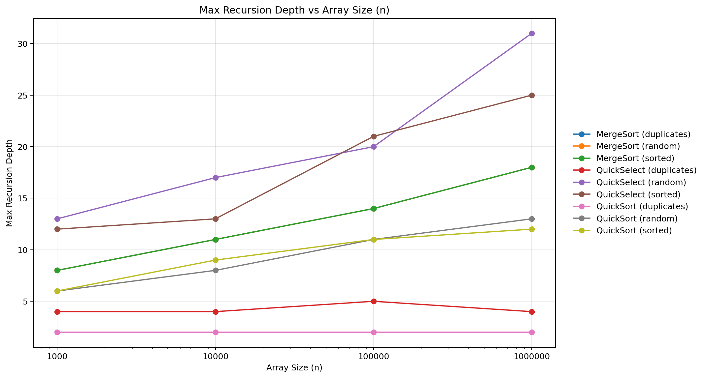
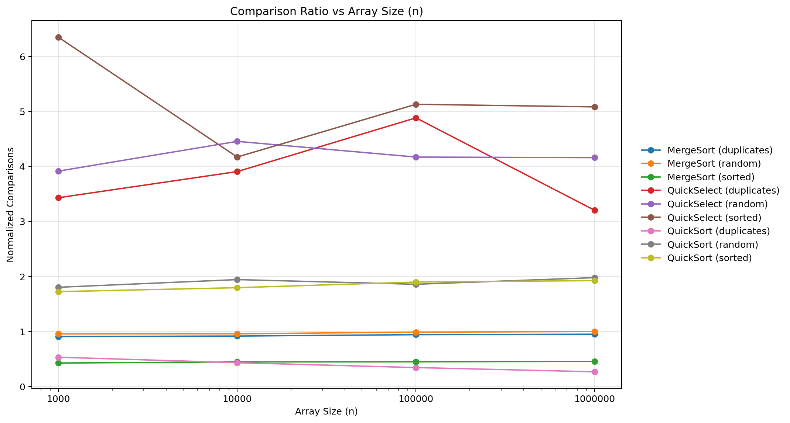

# Assignment 1 — Algorithm Analysis and Experimental Results

**Student:** Urazaliyeva Guldariya  
**Group:** SE-2521

## 1. Introduction

This assignment implements and analyzes three divide-and-conquer algorithms:

- MergeSort
- QuickSort
- QuickSelect

The algorithms were tested using three different types of input:

- Random arrays
- Sorted arrays
- Arrays with many duplicate values

The experiments were performed for the following input sizes:

- 1,000
- 10,000
- 100,000
- 1,000,000

The following metrics were measured:

- Running time in milliseconds
- Number of comparisons
- Maximum recursion depth

The complete experimental data are stored in `results.csv`.

---

## 2. Theoretical Analysis

### 2.1 MergeSort

MergeSort divides the array into two halves, recursively sorts both halves,
and then merges the sorted parts.

The recurrence relation is:

T(n) = 2T(n/2) + Θ(n)

Using the Master Theorem:

- a = 2
- b = 2
- f(n) = Θ(n)

Therefore:

T(n) = Θ(n log n)

The maximum recursion depth is Θ(log n), because the input size is divided
approximately in half at every recursive level.

In this implementation, small subarrays are handled using Insertion Sort.
For a subarray of size k, Insertion Sort has O(k²) worst-case complexity.
Because the cutoff size is limited to a small constant, this does not change
the overall Θ(n log n) asymptotic complexity of MergeSort.

---

### 2.2 QuickSort

QuickSort chooses a pivot and partitions the array around the pivot.

This implementation uses 3-way partitioning. Elements are divided into three
groups:

- Elements smaller than the pivot
- Elements equal to the pivot
- Elements greater than the pivot

A general recurrence can be written as:

T(n) = T(k) + T(n - k - 1) + Θ(n)

where k depends on the partition produced by the pivot.

For balanced partitions:

T(n) = 2T(n/2) + Θ(n)

and therefore, by the Master Theorem:

T(n) = Θ(n log n)

The expected running time of randomized QuickSort is Θ(n log n).

The theoretical worst-case running time is Θ(n²) when partitions are highly
unbalanced.

The implementation recursively processes only the smaller partition and
continues with the larger partition iteratively. This limits the recursion
stack depth compared with the traditional implementation.

The 3-way partition is especially useful for arrays containing many duplicate
values because elements equal to the pivot can be processed together.

---

### 2.3 QuickSelect

QuickSelect uses partitioning to find the k-th smallest element without
sorting the entire array.

Unlike QuickSort, QuickSelect continues only in the part of the array that
contains the requested element.

A general recurrence is:

T(n) = T(k) + Θ(n)

For reasonably balanced partitions, the expected complexity is:

T(n) = Θ(n)

The theoretical worst case is:

T(n) = Θ(n²)

QuickSelect therefore solves a different problem from MergeSort and
QuickSort. It should not be considered a replacement for a sorting algorithm
when a completely sorted array is required.

---

## 3. Experimental Setup

The benchmark evaluates MergeSort, QuickSort, and QuickSelect.

Three input types were used:

1. Random input
2. Sorted input
3. Input containing many duplicate values

The tested input sizes were:

- n = 1,000
- n = 10,000
- n = 100,000
- n = 1,000,000

The benchmark measures:

- Running time (`time_ms`)
- Number of comparisons (`comparisons`)
- Maximum recursion depth (`max_depth`)

Each configuration was executed 5 times and the results were averaged.

The raw benchmark results are stored in:

`results.csv`

---

## 4. Experimental Results

### 4.1 Running Time

#### Random Input

| n | MergeSort (ms) | QuickSort (ms) | QuickSelect (ms) |
|---:|---:|---:|---:|
| 1,000 | 0.2574 | 0.447399 | 0.0310 |
| 10,000 | 1.2371 | 1.212999 | 0.1372 |
| 100,000 | 9.797701 | 11.945301 | 1.3471 |
| 1,000,000 | 117.663499 | 148.909300 | 18.303100 |

#### Sorted Input

| n | MergeSort (ms) | QuickSort (ms) | QuickSelect (ms) |
|---:|---:|---:|---:|
| 1,000 | 0.0142 | 0.0489 | 0.006599 |
| 10,000 | 0.1888 | 0.6804 | 0.040001 |
| 100,000 | 2.276301 | 6.7487 | 0.472699 |
| 1,000,000 | 36.5371 | 80.8217 | 4.836501 |

#### Duplicates Input

| n | MergeSort (ms) | QuickSort (ms) | QuickSelect (ms) |
|---:|---:|---:|---:|
| 1,000 | 0.0296 | 0.019201 | 0.0135 |
| 10,000 | 0.406899 | 0.1758 | 0.1145 |
| 100,000 | 4.5218 | 1.7286 | 1.3571 |
| 1,000,000 | 55.361199 | 17.3687 | 12.0617 |

The running time increases as the input size grows.

For random input at n = 1,000,000, MergeSort required approximately
117.66 ms, QuickSort 148.91 ms, and QuickSelect 18.30 ms.

For sorted input at the same size, the measured times were approximately
36.54 ms, 80.82 ms, and 4.84 ms respectively.

For duplicate-heavy input, QuickSort performed much better than it did on
random input. At n = 1,000,000, QuickSort required approximately 17.37 ms.
This behavior is consistent with the use of 3-way partitioning, which can
process many values equal to the pivot efficiently.

QuickSelect has low measured running times because it does not completely
sort the array. It searches only for the required order statistic.

---

### 4.2 Number of Comparisons

#### Random Input

| n | MergeSort | QuickSort | QuickSelect |
|---:|---:|---:|---:|
| 1,000 | 9,523 | 17,969 | 3,916 |
| 10,000 | 127,212 | 258,125 | 44,568 |
| 100,000 | 1,639,343 | 3,085,496 | 417,157 |
| 1,000,000 | 19,889,337 | 39,433,739 | 4,160,679 |

#### Sorted Input

| n | MergeSort | QuickSort | QuickSelect |
|---:|---:|---:|---:|
| 1,000 | 4,236 | 17,179 | 6,351 |
| 10,000 | 59,248 | 238,570 | 41,721 |
| 100,000 | 744,016 | 3,152,997 | 513,130 |
| 1,000,000 | 9,071,040 | 38,353,712 | 5,084,132 |

#### Duplicates Input

| n | MergeSort | QuickSort | QuickSelect |
|---:|---:|---:|---:|
| 1,000 | 9,036 | 5,291 | 3,432 |
| 10,000 | 121,712 | 57,286 | 39,074 |
| 100,000 | 1,563,025 | 569,162 | 488,456 |
| 1,000,000 | 18,922,524 | 5,298,558 | 3,202,181 |

The number of comparisons depends on both the algorithm and the structure of
the input.

For duplicate-heavy input, QuickSort performed substantially fewer
comparisons than MergeSort at large input sizes. At n = 1,000,000,
QuickSort performed 5,298,558 comparisons, while MergeSort performed
18,922,524 comparisons.

---

## 5. Maximum Recursion Depth

### Random Input

| n | MergeSort | QuickSort | QuickSelect |
|---:|---:|---:|---:|
| 1,000 | 8 | 6 | 13 |
| 10,000 | 11 | 8 | 17 |
| 100,000 | 14 | 11 | 20 |
| 1,000,000 | 18 | 13 | 31 |

### Sorted Input

| n | MergeSort | QuickSort | QuickSelect |
|---:|---:|---:|---:|
| 1,000 | 8 | 6 | 12 |
| 10,000 | 11 | 9 | 13 |
| 100,000 | 14 | 11 | 21 |
| 1,000,000 | 18 | 12 | 25 |

### Duplicates Input

| n | MergeSort | QuickSort | QuickSelect |
|---:|---:|---:|---:|
| 1,000 | 8 | 2 | 4 |
| 10,000 | 11 | 2 | 4 |
| 100,000 | 14 | 2 | 5 |
| 1,000,000 | 18 | 2 | 4 |

MergeSort shows predictable logarithmic growth in recursion depth. Its
measured depth increases from 8 at n = 1,000 to 18 at n = 1,000,000.

QuickSort also maintains relatively small recursion depth in these
experiments. For duplicate-heavy input, its measured maximum depth remains 2.

QuickSelect shows more variation. For random input its measured maximum depth
increases from 13 to 31.

---

## 6. Ratio Analysis

To compare the experimental number of comparisons with the expected
asymptotic behavior, normalized ratios were calculated.

For MergeSort and QuickSort:

ratio = comparisons / (n × log2(n))

For QuickSelect:

ratio = comparisons / n

If the experimental number of comparisons follows the expected asymptotic
growth, these normalized values should remain approximately constant as n
becomes large.

For example, at n = 1,000,000:

### MergeSort

- Random input: approximately 0.998
- Sorted input: approximately 0.455
- Duplicates input: approximately 0.949

### QuickSort

- Random input: approximately 1.979
- Sorted input: approximately 1.924
- Duplicates input: approximately 0.266

### QuickSelect

- Random input: approximately 4.161
- Sorted input: approximately 5.084
- Duplicates input: approximately 3.202

The ratios for MergeSort and QuickSort remain within constant ranges for the
tested input types. This is consistent with Θ(n log n) behavior for these
experiments.

The QuickSelect ratios are also of constant order for the tested values of n,
which is consistent with expected linear behavior.

Approximate experimental constants can therefore be described by constant
bounds for sufficiently large tested values of n. For example, using
n0 = 100,000, the observed normalized ratios remain bounded by fixed positive
constants c1 and c2 for each algorithm and input type.

These empirical observations support the theoretical asymptotic analysis,
although they do not constitute a mathematical proof of the asymptotic
bounds.

---

## 7. Discussion

The experiments demonstrate that asymptotic complexity is important, but the
structure of the input also affects practical performance.

MergeSort shows stable recursion-depth behavior for all three input types.
Its recursion depth grows logarithmically as expected.

QuickSort shows particularly good behavior for duplicate-heavy arrays in this
implementation. The 3-way partition groups values equal to the pivot, which
reduces the amount of additional partitioning required when many duplicate
values are present.

QuickSelect has lower measured running times and fewer comparisons in many of
the experiments because it solves a selection problem rather than fully
sorting the array.

Running-time measurements should also be interpreted carefully. They can be
affected by hardware, JVM warm-up, garbage collection, and other system
activity. For this reason, the number of comparisons and recursion depth are
useful additional metrics when analyzing the algorithms.

---

## 8. Conclusion

The experimental results are generally consistent with the theoretical
analysis.

MergeSort demonstrates Θ(n log n) behavior and logarithmic recursion depth.
QuickSort has expected Θ(n log n) performance and benefits significantly from
3-way partitioning when the input contains many duplicate values.
QuickSelect demonstrates behavior consistent with expected Θ(n) selection
performance in these experiments.

The normalized comparison ratios provide additional empirical evidence for
the expected growth rates.

Overall, the experiments show that both theoretical complexity and input
structure are important when evaluating algorithm performance.

The complete benchmark data are available in `results.csv`.